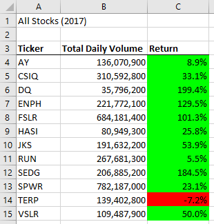
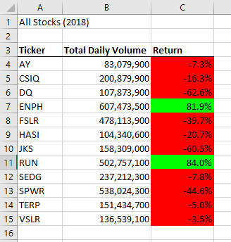

# stock-analysis
## Overview of Project
### Purpose
This project is a detailed analysis of a large set of stocks data in a macro-enabled excel document that summarizes the information into individual ticker volume and change in price with conditional formatting for visual interpretation of the change in price.

## Results

### Comparison Between 2017 and 2018 Stock Performance
  

The overall comparison between the 2017 and 2018 stock perfomances, we can notice that majority of the 2017 stocks were in the green, a positive gain in their ticker price, versus 218 where majority of the stocks were red or negative. In 2017, the most traded stock was SPWR and least was DQ where in 2018 it was ENPH and AY respectively. After further analysis, the most successful stock over the years is ENPH where they had a 129.5% increase in 2017 and 81.9% increase in 2018. The only other stock to show a positive gain over the 2 years is RUN which had a minimal increase of 5.5% in 2017 and much larger increase of 84% in 2018. The only stock to have a negative decrease in both years was TERP. With this comparision, we can safely assume that ENPH would be the best stock to invest in and TERP would be the most unfavourable choice. 

### Execution Times Between Original and Refractored Script
With the use of the refractored script, we were able to see a significant decrease in execution time for the analysis of the data. Below are the execution times for each scenario:

#####Orignal script execution time was 0.8671875 for 2017

Orignal script execution time was 0.8984375 for 2018

Refractored script execution time was 0.2460938 for 2017

Refractored script execution time was 0.1914063 for 2018

With further analyis of the execution times, the percentage decrease in time due to refractored code is 71.62% for 2017 and 78.70% for 2018. This can be extremely favorable when running this analysis on a much larger data set. If the data set was so large that it took the original script to execute the analysis in 1 minute, the refractored script would cut it down to approximately 15 seconds. It's fair to say that in some cases, less lines of code, that uses arrays, allow the code to work more efficiently using less RAM and time to reach the same goal.

## Summary

The main advantage of using the refractored script is the reduction in RAM and time used by its execution. This can be extremely favorable when running this analysis on a much larger data set. Another advantage is that the script has much less lines and easier to filter through to make adjustments to allow this script to run on data sets with more tickers. This is also a disadvantage of this particular script. This script would not be able to run on any data set for stock analysis. The number of tickers is dependant on the script to run accurately. Any more would not allow the script to capture the complete results. Also, any data sets that are not formatted in the same columns would not allow the script to run or provide accurate details. Another disadvanatage would be that the closing stock price would need to be the last available data set in the group for the return to be calculated properly.

The main disadvantage of the refractored script versus the original one would be that if the ticker names were not grouped together, the refractored script would not give out accurate details or come across an error. In order for the refractored script to run accurately, the tickers need to be grouped together. This would not need to be the case for the original script. By mixing the tickers around, the script can still find the correct outcomes even though it takes longer to run. The refractored code is more efficient as long as the tickers are grouped.
